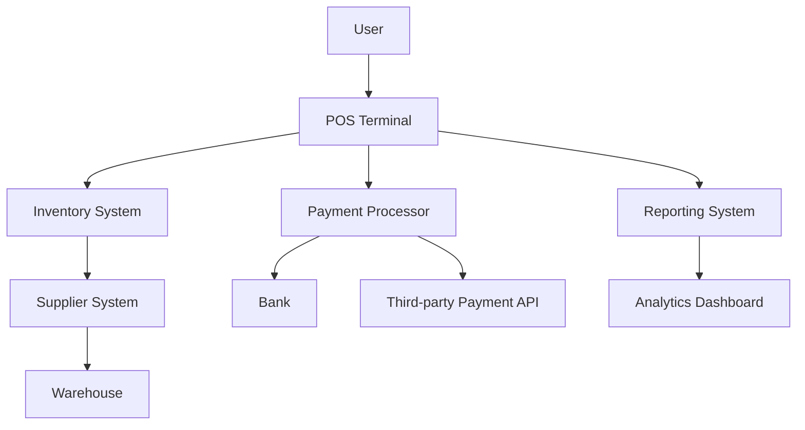

```mermaid
graph TD;
    A[User] --> B[POS Terminal];
    B --> C[Payment Processor];
    B --> D[Inventory System];
    D --> E[Supplier System];
    E --> F[Warehouse];
    C --> G[Bank];
    C --> H[Third-party Payment API];
    B --> I[Reporting System];
    I --> J[Analytics Dashboard];
```